# Modellbildung-Und-Simulation-Mechatronischer-Systeme (Automatisierungtechnik)

## Inhalt

Dieses Repository basiert auf dem Kurs „Modellbildung und Simulation mechatronischer Systeme“ an der Technischen Universität Berlin, der ein obligatorischer Teilbereich des Kurses [„Simulation und Technische Diagnose“](https://moseskonto.tu-berlin.de/moses/modultransfersystem/bolognamodule/beschreibung/anzeigen.html?nummer=40706&version=10&sprache=de) ist.

Ziel ist es verschiedene Modellierungsverfahren kennenzulernen und Anwendungsbeispiele mit der Software Modellica umzusetzten. Dazu wurden 3 Pratikas absolviert jeweils für die Themen:

- Praktika 1: Physikalisch-orientierte Modellbildung und Simulation – kausal
- Praktika 2: Physikalisch-orientierte Modellbildung und Simulation – akausal
- Praktika 3:           Datenbasierte Modellbildung                 – Identifikation

Im folgenden, werden die einzelnen Teilbereiche näher erläutert. 

## Vorwort

Die Modellierung und Simulation von Maschinen ist eine wichtige Voraussetzung für die Umsetzung realer Projekte. Sie bietet die Möglichkeit, den realen Prozess abstrakt mit verschiedener Software darzustellen. Zudem bringt die Modellierung viele Vorteile mit sich: Zum Beispiel können erhebliche Kosten eingespart und die Sicherheit durch zahlreiche Tests gewährleistet werden, ohne das physische System zu beschädigen.
<!-- Die nachfolgenden Inhalte stützen sich auf die Konzepte von Model-in-the-Loop (MiL) und Software-in-the-Loop (SiL). Diese Phasen beinhalten die Erstellung physikalischer und datenbasierter Modelle sowie deren Simulation mit numerischen Verfahren.
Nach einer erfolgreichen Testphase mit MiL und SiL kann im nächsten Schritt Hardware-in-the-Loop (HiL) eingesetzt werden (dies wird hier nicht betrachtet). Dabei wird das Steuergerät in das Simulationssystem integriert. -->

### Physikalisch-orientierte Modellbildung und Simulation – kausal

In der ersten Phase wird die physikalisch-orientierte Modellbildung basierend auf Basis von Differenzial-Algebraischen Gleichungen untersucht. Dabei liegt der Fokus auf eine Signal-flussorientierte (kausale) Modellierung. Es wurde eine Scheibläufermaschine in Modellica simuliert und eine reale Messung (mit Antrieb, Generator und Drehzahlmesser) durchgeführt. Ziel ist es, die gemessenen Werte mit den Simulationswerte zu vergleichen, um am Ende eine Aussage über die Übereinstimmung zu treffen. Es gibt drei verschiedene Umsetzungsmöglichkeiten: die Zustandsraumdarstellung, die Übertragungsfunktion oder die direkte Umsetzung mittels Blockschaltbild. In Modelica wurde das Modell mithilfe der direkten Umsetzung (Blockschaltbild) simuliert. Nach der realen Messung wurden die Werte mithilfe des normalisierten Root-Mean-Square-Error ausgewertet.

Das Protkoll zu dem Versuch ist unter diesem Link verfügbar: 
[Google Drive](https://drive.google.com/file/d/1h5TW_BGzKsXgrvK_b4RTWAj3D2FF_GCN/view?usp=sharing)

Einige Ergebnisse sind in den folgenden Darstellungen aufgeführt:

#### Umsetzung Antrieb+Generator in Modellica (Kausal)

| 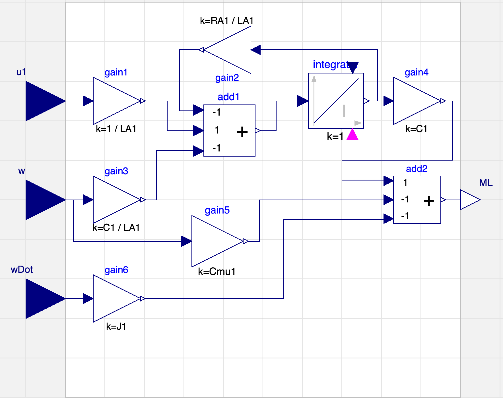 | 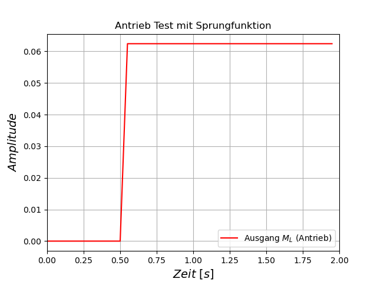 | 
| :------------------------------------------------------------------: | :----------------------------------------------------------------: |

| 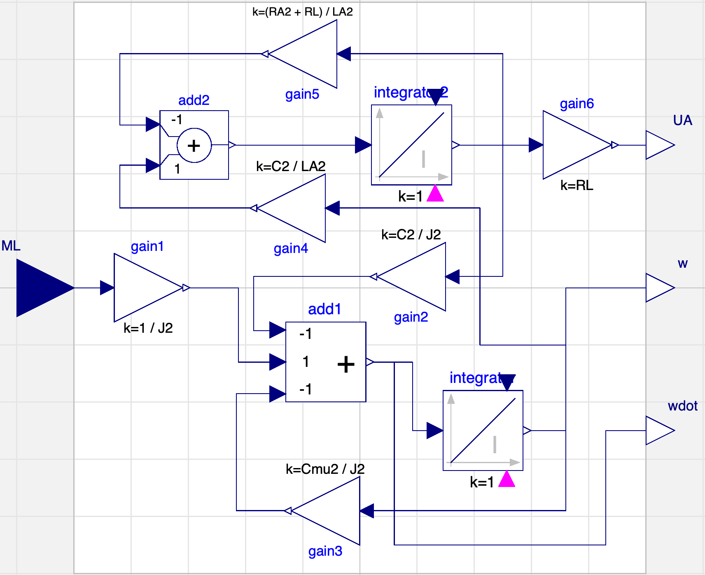 | 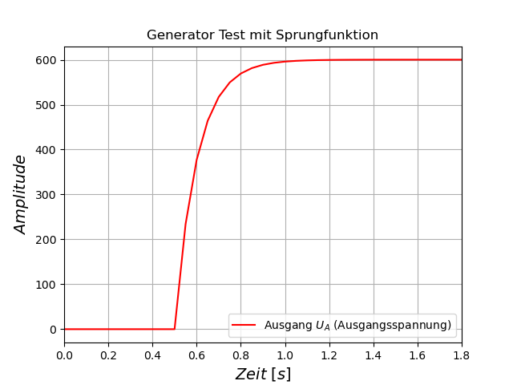 | 
| :-------------------------------------------------------------------: | :-------------------------------------------------------------------: |

<!-- |   | 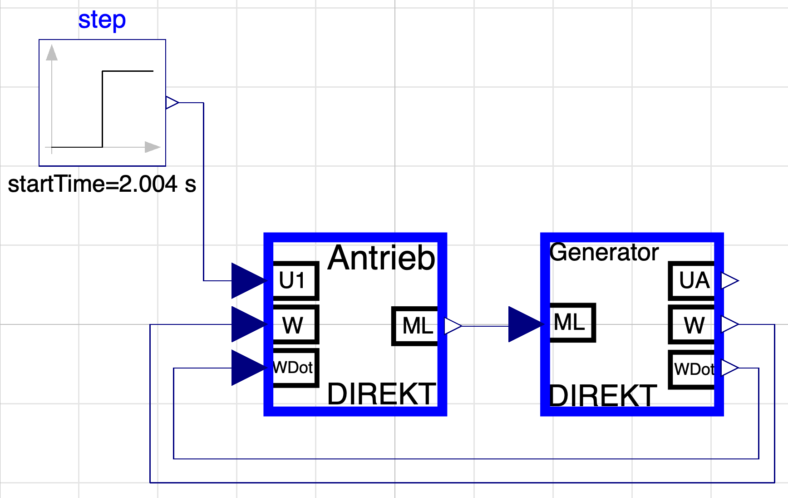 |   |
|:-:|:-------------------------------------------------------------------------------------------------:|:-:| -->

<!--  -->

  

### Physikalisch-orientierte Modellbildung und Simulation – akausal

In der zweiten Phase wird die physikalisch-orientierte Modellbildung ebenfalls basierend auf Basis von Differenzial-Algebraischen Gleichungen untersucht. Dabei liegt der Fokus auf eine Objektorientierte (akausale) Modellierung. Der Unterschied zur kausalen Modellierung besteht darin, dass bei der akausalen Modellierung die Ein- und Ausgänge nicht vorab festgelegt sind. Stattdessen wird die akausalen Modellierung durch seine Zustands- und Erhaltungsgleichungen beschrieben. Die Kausalität wird erst während der Lösung des Gleichungssystems bestimmt, wenn das Modell numerisch berechnet wird. Diese Berechnungen erfolgen mit den von Modelica bereitgestellten Integrationsverfahren, wie dem Euler-Verfahren oder dem DASSL-Solver, die je nach Anforderungen manuell ausgewählt werden können.
Es wurde die gleiche Scheibläufermaschine in Modellica simuliert wie in Phase1. Ziel ist es, die Simulationswerten aus Phase1 und Phase2 zu vergleichen und die akausale Modellbilldung umzusetzen. 

Einige Ergebnisse sind in den folgenden Darstellungen aufgeführt:

#### Umsetzung Antrieb+Generator in Modellica (AKausal)

| 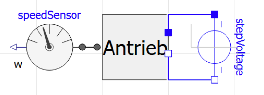 | 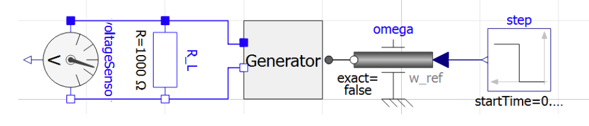 |  |
|:------------------------------------------------------------------:|:------------------------------------------------------------------:|:------------------------------------------------------------------:|

<!-- 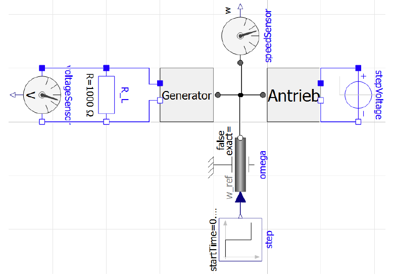 -->
<!-- 

  

  -->

### Datenbasierte Modellbildung – Identifikation

In der dritten Phase wird der Schwerpunkt auf die datenbasierte Modellierung gesetzt. Dabei werden Methoden der Prozessidentifikation verwendet.
Es wird sowohl der dynamische als auch der statische Fall betrachtet.
Bei beiden Versuche wird eine Parameteridentifikation durchgeführt, um ein Modell des Systems zu erstellen. Dabei werden die Parameter auf Basis von Daten geschätzt (mithilfe der Methode der kleinsten Fehlerquadrate). Dies ist eine gängige Methode in der Regelungstechnik , da viele Systeme nicht vollständig durch physikalische Gesetze beschrieben werden können oder deren exakte Parameter nicht direkt messbar sind. Viele Systeme enthalten Parameter wie Trägheit oder Widerstände, die nicht direkt gemessen werden können.
Diese Parameter werden anhand gemessener Ein- und Ausgangsdaten geschätzt.
Im ersten Versuchsabschnitt wird das dynamische Übertragungsverhalten eines Verbrennungsmotors in einem Arbeitspunkt identifiziert. Die Ausgangsgröße ist das Drehmoment und die Eingangsgröße sind die Drehzahl und der Drosselklappenwinkel. Das Ziel besteht darin, die Parameter zu schätzen, die die Beziehung zwischen den Ein- und Ausgangsgrößen beschreiben, um das Verhalten des Systems vorherzusagen.
Im zweiten Abschnitt wird das statische Verhalten des Systems durch verschiedene Arbeitspunkte untersucht. 
Dieses System beschreibt wie sich die Ausgangsgröße des Motors bei festen
Eingangsrößen verhält (eingeschwungender Zustand).
Bei beiden Teilversuchen wird die Güte des Modells mit dem Bestimmunsmaß R² bestimmt. 

Das Protkoll zu dem Versuch ist unter diesem Link verfügbar: 
[Google Drive](https://drive.google.com/file/d/1odjTM6QrR6cDpzYTmP6d14tMWM4jksG3/view?usp=sharing)

Einige Ergebnisse sind in den folgenden Darstellungen aufgeführt:

#### Dynamische und Statische Verhalten eines Verbrennungsmotor 

| 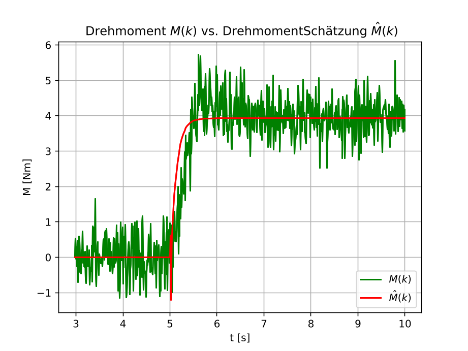 | 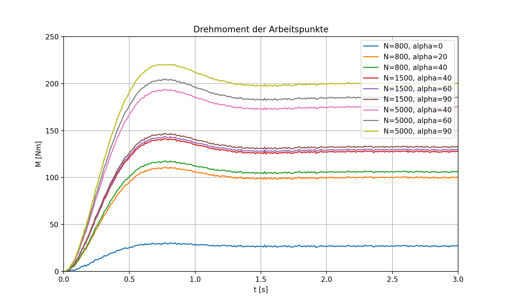 | 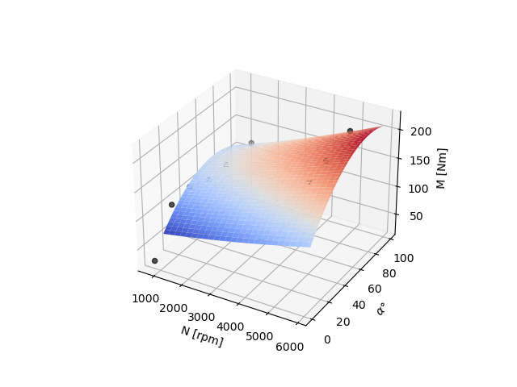 |
|:------------------------------------------------------------------:|:------------------------------------------------------------------:|:------------------------------------------------------------------:|

<!--  -->
